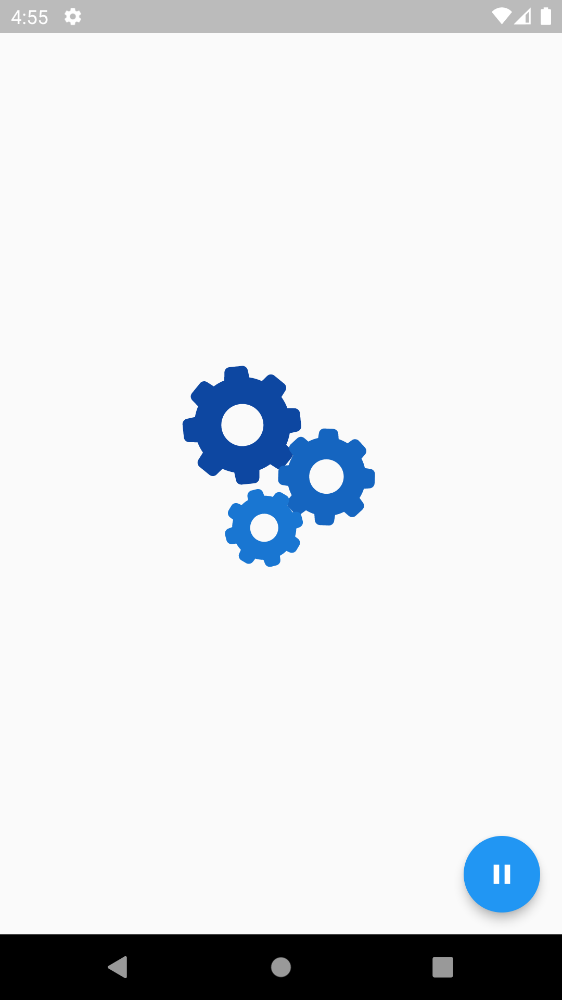
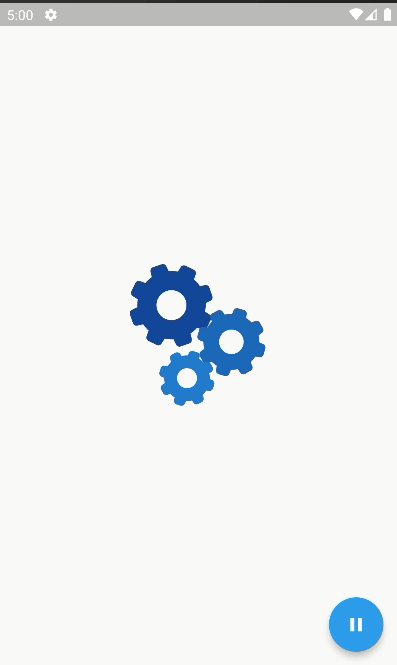
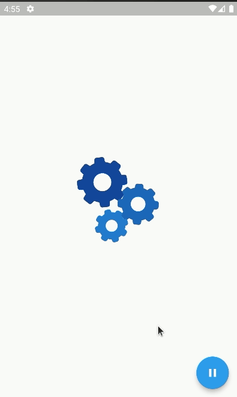

# Rive Animation App

A simple application that uses an animation from Rive. We can put Pause or play through the button or by clicking on the animation itself.

### Demo

&nbsp;&nbsp;&nbsp;&nbsp;&nbsp;&nbsp;&nbsp;&nbsp;&nbsp;&nbsp;

## Installation

##### 1. Clone the repository

```bash
git clone https://github.com/edilsonmatola/flutter_rive_.git
```

##### 2. Move to the desired folder

```bash
cd flutter_rive
```

##### 3. To run the app, simply write the following commands:

```bash
flutter pub get
# flutter emulators --launch "emulator_id" (to get Android Simulator)
open -a simulator (to get iOS Simulator)
flutter run
```